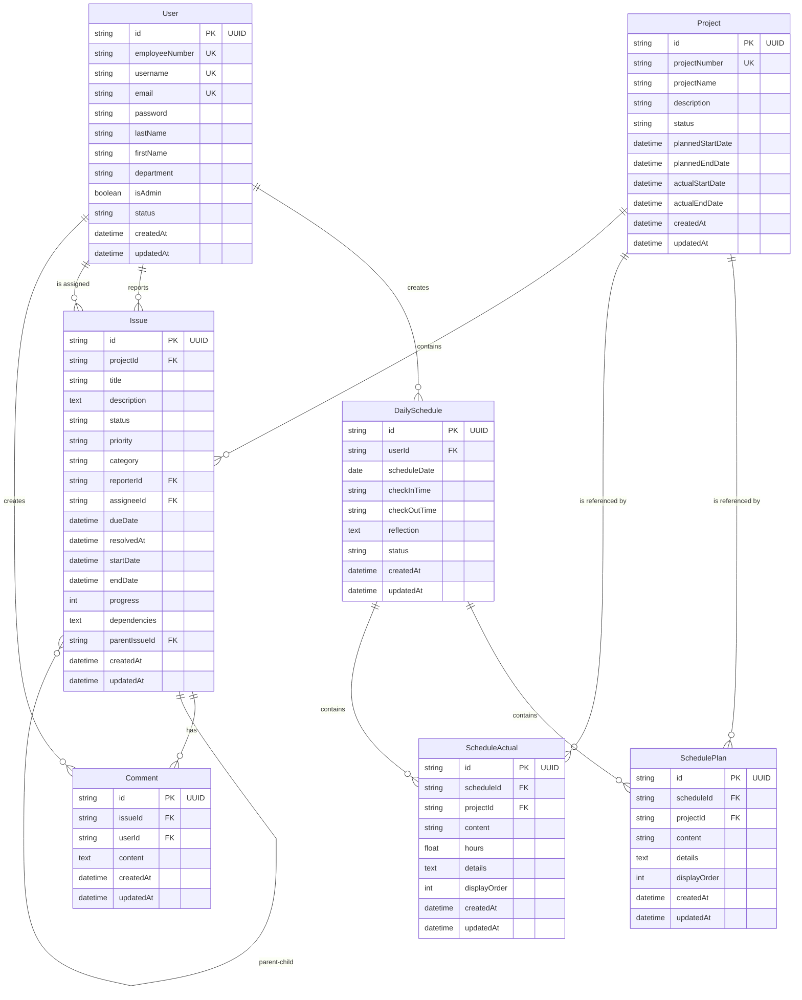

# データベース設計書

## 1. 概要

### 1.1 データベース基本情報
- **DBMS**: PostgreSQL (Neon)
- **ORM**: Prisma
- **文字コード**: UTF-8
- **照合順序**: ja_JP.UTF-8

### 1.2 設計方針
- 第3正規形を基本とした正規化設計
- 物理削除の採用（論理削除フィールドなし）
- UUIDを主キーとして使用
- Prismaの命名規則に準拠（キャメルケース）
- タイムスタンプフィールド（createdAt, updatedAt）の自動管理

## 2. ER図

## 3. テーブル定義

### 3.1 User（ユーザー）

| カラム名 | データ型 | NULL | デフォルト | 説明 |
|---------|---------|------|-----------|------|
| id | UUID | NO | uuid() | 主キー |
| employeeNumber | VARCHAR(50) | NO | - | 社員番号（ユニーク） |
| username | VARCHAR(50) | NO | - | ユーザー名（ユニーク） |
| email | VARCHAR(255) | NO | - | メールアドレス（ユニーク） |
| password | VARCHAR(255) | NO | - | パスワード（bcryptハッシュ） |
| lastName | VARCHAR(50) | NO | - | 姓 |
| firstName | VARCHAR(50) | NO | - | 名 |
| department | VARCHAR(100) | YES | - | 部署 |
| isAdmin | BOOLEAN | NO | false | 管理者権限フラグ |
| status | VARCHAR(20) | NO | 'active' | ステータス（active/inactive） |
| createdAt | TIMESTAMP | NO | now() | 作成日時 |
| updatedAt | TIMESTAMP | NO | updatedAt | 更新日時 |

**インデックス:**
- PRIMARY KEY (id)
- UNIQUE KEY (employeeNumber)
- UNIQUE KEY (username)
- UNIQUE KEY (email)
- INDEX (status)

### 3.2 Project（プロジェクト）

| カラム名 | データ型 | NULL | デフォルト | 説明 |
|---------|---------|------|-----------|------|
| id | UUID | NO | uuid() | 主キー |
| projectNumber | VARCHAR(50) | NO | - | プロジェクト番号（ユニーク） |
| projectName | VARCHAR(255) | NO | - | プロジェクト名 |
| description | TEXT | YES | - | 説明 |
| status | VARCHAR(20) | NO | 'planning' | ステータス |
| plannedStartDate | TIMESTAMP | YES | - | 予定開始日 |
| plannedEndDate | TIMESTAMP | YES | - | 予定終了日 |
| actualStartDate | TIMESTAMP | YES | - | 実績開始日 |
| actualEndDate | TIMESTAMP | YES | - | 実績終了日 |
| createdAt | TIMESTAMP | NO | now() | 作成日時 |
| updatedAt | TIMESTAMP | NO | updatedAt | 更新日時 |

**ステータス値:**
- planning: 計画中
- developing: 開発中
- active: 稼働中
- suspended: 一時停止
- completed: 完了

**インデックス:**
- PRIMARY KEY (id)
- UNIQUE KEY (projectNumber)
- INDEX (status)

### 3.3 DailySchedule（日別スケジュール）

| カラム名 | データ型 | NULL | デフォルト | 説明 |
|---------|---------|------|-----------|------|
| id | UUID | NO | uuid() | 主キー |
| userId | UUID | NO | - | ユーザーID |
| scheduleDate | DATE | NO | - | スケジュール日付 |
| checkInTime | VARCHAR(5) | YES | - | 出社時刻（HH:MM形式） |
| checkOutTime | VARCHAR(5) | YES | - | 退社時刻（HH:MM形式） |
| reflection | TEXT | YES | - | 所感 |
| status | VARCHAR(20) | NO | 'planned' | ステータス |
| createdAt | TIMESTAMP | NO | now() | 作成日時 |
| updatedAt | TIMESTAMP | NO | updatedAt | 更新日時 |

**ステータス値:**
- planned: 予定
- in_progress: 進行中
- completed: 完了

**インデックス:**
- PRIMARY KEY (id)
- UNIQUE KEY (userId, scheduleDate)
- FOREIGN KEY (userId) REFERENCES User(id)

### 3.4 SchedulePlan（予定項目）

| カラム名 | データ型 | NULL | デフォルト | 説明 |
|---------|---------|------|-----------|------|
| id | UUID | NO | uuid() | 主キー |
| scheduleId | UUID | NO | - | スケジュールID |
| projectId | UUID | YES | - | プロジェクトID |
| content | VARCHAR(255) | NO | - | 予定内容 |
| details | TEXT | YES | - | 詳細 |
| displayOrder | INTEGER | NO | 0 | 表示順 |
| createdAt | TIMESTAMP | NO | now() | 作成日時 |
| updatedAt | TIMESTAMP | NO | updatedAt | 更新日時 |

**インデックス:**
- PRIMARY KEY (id)
- INDEX (scheduleId, displayOrder)
- FOREIGN KEY (scheduleId) REFERENCES DailySchedule(id) ON DELETE CASCADE
- FOREIGN KEY (projectId) REFERENCES Project(id)

### 3.5 ScheduleActual（実績項目）

| カラム名 | データ型 | NULL | デフォルト | 説明 |
|---------|---------|------|-----------|------|
| id | UUID | NO | uuid() | 主キー |
| scheduleId | UUID | NO | - | スケジュールID |
| projectId | UUID | YES | - | プロジェクトID |
| content | VARCHAR(255) | NO | - | 実績内容 |
| hours | FLOAT | NO | - | 実績時間 |
| details | TEXT | YES | - | 詳細 |
| displayOrder | INTEGER | NO | 0 | 表示順 |
| createdAt | TIMESTAMP | NO | now() | 作成日時 |
| updatedAt | TIMESTAMP | NO | updatedAt | 更新日時 |

**インデックス:**
- PRIMARY KEY (id)
- INDEX (scheduleId, displayOrder)
- FOREIGN KEY (scheduleId) REFERENCES DailySchedule(id) ON DELETE CASCADE
- FOREIGN KEY (projectId) REFERENCES Project(id)

### 3.6 Issue（課題）

| カラム名 | データ型 | NULL | デフォルト | 説明 |
|---------|---------|------|-----------|------|
| id | UUID | NO | uuid() | 主キー |
| projectId | UUID | NO | - | プロジェクトID |
| title | VARCHAR(255) | NO | - | タイトル |
| description | TEXT | NO | - | 説明 |
| status | VARCHAR(20) | NO | 'open' | ステータス |
| priority | VARCHAR(20) | NO | 'medium' | 優先度 |
| category | VARCHAR(50) | YES | - | カテゴリ |
| reporterId | UUID | NO | - | 報告者ID |
| assigneeId | UUID | YES | - | 担当者ID |
| dueDate | TIMESTAMP | YES | - | 期限 |
| resolvedAt | TIMESTAMP | YES | - | 解決日時 |
| startDate | TIMESTAMP | YES | - | 開始日（ガント用） |
| endDate | TIMESTAMP | YES | - | 終了日（ガント用） |
| progress | INTEGER | NO | 0 | 進捗率（0-100） |
| dependencies | TEXT | YES | - | 依存関係（JSON） |
| parentIssueId | UUID | YES | - | 親課題ID |
| createdAt | TIMESTAMP | NO | now() | 作成日時 |
| updatedAt | TIMESTAMP | NO | updatedAt | 更新日時 |

**ステータス値:**
- open: 未対応
- in_progress: 対応中
- resolved: 解決済み
- closed: クローズ

**優先度値:**
- low: 低
- medium: 中
- high: 高
- critical: 緊急

**カテゴリ値:**
- bug: バグ
- feature: 機能追加
- improvement: 改善
- task: タスク

**インデックス:**
- PRIMARY KEY (id)
- INDEX (status, priority)
- INDEX (projectId)
- INDEX (assigneeId)
- INDEX (dueDate)
- FOREIGN KEY (projectId) REFERENCES Project(id)
- FOREIGN KEY (reporterId) REFERENCES User(id)
- FOREIGN KEY (assigneeId) REFERENCES User(id)
- FOREIGN KEY (parentIssueId) REFERENCES Issue(id)

### 3.7 Comment（コメント）

| カラム名 | データ型 | NULL | デフォルト | 説明 |
|---------|---------|------|-----------|------|
| id | UUID | NO | uuid() | 主キー |
| issueId | UUID | NO | - | 課題ID |
| userId | UUID | NO | - | ユーザーID |
| content | TEXT | NO | - | コメント内容 |
| createdAt | TIMESTAMP | NO | now() | 作成日時 |
| updatedAt | TIMESTAMP | NO | updatedAt | 更新日時 |

**インデックス:**
- PRIMARY KEY (id)
- INDEX (issueId, createdAt)
- FOREIGN KEY (issueId) REFERENCES Issue(id) ON DELETE CASCADE
- FOREIGN KEY (userId) REFERENCES User(id)

## 4. Prismaスキーマ実装

### 4.1 命名規則
- モデル名: PascalCase（例: User, SchedulePlan）
- フィールド名: camelCase（例: userId, createdAt）
- テーブル名マッピング: snake_case（@@map使用）

### 4.2 リレーション定義の特徴
- カスケード削除: DailySchedule → SchedulePlan/ScheduleActual
- カスケード削除: Issue → Comment  
- 自己参照: Issue（親子関係）
- 多対多: なし（中間テーブル不使用）

### 4.3 データ型マッピング

| PostgreSQL | Prisma | 備考 |
|------------|--------|------|
| UUID | String @id @default(uuid()) | 主キー |
| VARCHAR | String | 文字列 |
| TEXT | String @db.Text | 長文テキスト |
| BOOLEAN | Boolean | 真偽値 |
| DATE | DateTime @db.Date | 日付のみ |
| TIMESTAMP | DateTime | 日時 |
| FLOAT | Float | 浮動小数点 |
| INTEGER | Int | 整数 |

## 5. インデックス設計

### 5.1 インデックス設計方針
- 主キー（UUID）は自動的にインデックス化
- ユニーク制約にはインデックス自動付与
- 外部キーにはインデックスを設定
- 検索条件に使用される頻度の高いカラムにインデックス設定

### 5.2 複合インデックス
- DailySchedule: (userId, scheduleDate) - ユーザー別日付検索用
- Issue: (status, priority) - ステータス×優先度絞り込み用
- SchedulePlan/ScheduleActual: (scheduleId, displayOrder) - 表示順制御用

## 6. セキュリティ考慮事項

### 6.1 パスワード管理
- bcryptによるハッシュ化（salt rounds: 10）
- 平文パスワードは保存しない
- パスワード変更時は再ハッシュ化

### 6.2 アクセス制御
- 管理者権限（isAdmin）による機能制限
- ユーザーステータス（active/inactive）による認証制御
- セッション管理にnext-auth使用

### 6.3 データ整合性
- CASCADE DELETE設定
  - DailySchedule削除時: SchedulePlan/ScheduleActual自動削除
  - Issue削除時: Comment自動削除
- 外部キー制約による参照整合性保証

## 7. パフォーマンス考慮事項

### 7.1 N+1問題対策
- Prismaのinclude/selectを適切に使用
- 関連データの一括取得

### 7.2 ページネーション
- cursor-based pagination推奨（大規模データ）
- offset/limit併用（小規模データ）

### 7.3 クエリ最適化
- 必要なフィールドのみselect
- 不要なリレーション取得を避ける

## 8. マイグレーション戦略

### 8.1 Prisma Migrate
- 開発環境: `prisma migrate dev`
- 本番環境: `prisma migrate deploy`
- スキーマ変更履歴はmigrationsフォルダで管理

### 8.2 初期データ
- seed.tsによる初期データ投入
- 管理者ユーザーの作成
- サンプルプロジェクト・課題の投入

## 9. バックアップ・リカバリ

### 9.1 バックアップ方針
- Neonの自動バックアップ機能活用
- Point-in-time recovery対応

### 9.2 リカバリ手順
1. Neonダッシュボードからバックアップ選択
2. 特定時点へのロールバック実行
3. アプリケーション再起動

## 10. 今後の拡張予定

### 10.1 検討中の機能
- ファイル添付機能（Attachment テーブル）
- 通知機能（Notification テーブル）
- アクティビティログ（ActivityLog テーブル）

### 10.2 スケーラビリティ対策
- パーティショニング（大規模データ対応）
- 読み取り専用レプリカ（負荷分散）
- キャッシュレイヤー（Redis導入）