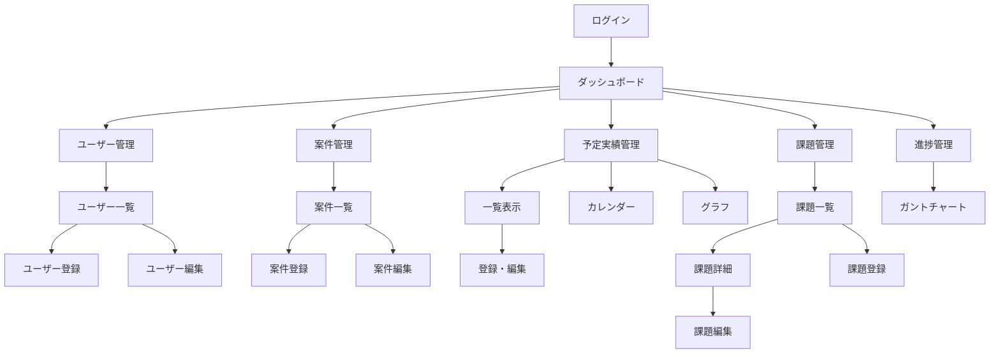

# モック作成計画書

## 1. 概要

### 1.1 目的
- Next.js + shadcn/uiを使用したUIモックアップの作成
- ユーザビリティを重視した画面設計
- 段階的な機能実装を可能にする基盤構築

### 1.2 技術スタック
- **Framework**: Next.js 14 (App Router)
- **UI Library**: shadcn/ui
- **Styling**: Tailwind CSS
- **Type Safety**: TypeScript
- **Icons**: Lucide React

### 1.3 開発方針
- モバイルファースト設計
- アクセシビリティ準拠
- ダークモード対応
- レスポンシブデザイン

## 2. 画面構成

### 2.1 画面一覧

| カテゴリ | 画面名 | パス | 説明 |
|---------|--------|------|------|
| **認証** | ログイン | `/login` | メールアドレス・パスワード認証 |
| **共通** | ダッシュボード | `/dashboard` | 各機能への導線・サマリー表示 |
| **共通** | レイアウト | - | ヘッダー・サイドバー・フッター |
| **ユーザー管理** | ユーザー一覧 | `/users` | ユーザー管理（管理者のみ） |
| **ユーザー管理** | ユーザー登録・編集 | `/users/new`, `/users/[id]/edit` | ユーザー情報の登録・編集 |
| **案件管理** | 案件一覧 | `/projects` | 案件の一覧表示 |
| **案件管理** | 案件登録・編集 | `/projects/new`, `/projects/[id]/edit` | 案件情報の登録・編集 |
| **予定実績** | 予定実績一覧 | `/schedules` | テーブル形式での一覧表示 |
| **予定実績** | カレンダー表示 | `/schedules/calendar` | カレンダー形式での表示 |
| **予定実績** | グラフ表示 | `/schedules/chart` | 実績時間のグラフ表示 |
| **予定実績** | 予定実績登録・編集 | `/schedules/new`, `/schedules/[id]/edit` | 予定実績の登録・編集 |
| **課題管理** | 課題一覧 | `/issues` | 課題の一覧表示 |
| **課題管理** | 課題詳細 | `/issues/[id]` | 課題詳細とコメント |
| **課題管理** | 課題登録・編集 | `/issues/new`, `/issues/[id]/edit` | 課題の登録・編集 |
| **進捗管理** | ガントチャート | `/gantt` | タスクの進捗管理 |

### 2.2 画面遷移フロー



## 3. UI設計詳細

### 3.1 共通レイアウト

#### ヘッダー
- ロゴ・アプリケーション名
- ユーザー情報表示
- ログアウトボタン
- 通知アイコン（将来拡張）

#### サイドバー
- ナビゲーションメニュー
- アクティブページのハイライト
- 折りたたみ可能
- アイコン + テキスト表示

#### フッター
- コピーライト表示
- バージョン情報

### 3.2 各画面のUI要件

#### ログイン画面
- **レイアウト**: センター配置、カード形式
- **要素**:
  - メールアドレス入力欄
  - パスワード入力欄
  - ログインボタン
  - パスワードリセットリンク
  - エラーメッセージ表示領域

#### ダッシュボード
- **レイアウト**: グリッドレイアウト
- **要素**:
  - サマリーカード（統計情報）
  - 最近の活動
  - クイックアクセスボタン
  - 今日の予定表示
  - 未対応課題リスト

#### 一覧画面共通
- **レイアウト**: テーブル形式
- **要素**:
  - 検索バー
  - フィルター機能
  - ソート機能
  - ページネーション
  - 一括操作ボタン
  - 新規作成ボタン

#### 登録・編集画面共通
- **レイアウト**: フォーム形式
- **要素**:
  - 入力フィールド
  - バリデーションエラー表示
  - 保存・キャンセルボタン
  - 確認ダイアログ

#### カレンダー表示
- **レイアウト**: 月/週/日表示切替
- **要素**:
  - ナビゲーション（前後移動）
  - 今日ボタン
  - イベント表示
  - ドラッグ&ドロップ（将来実装）

#### グラフ表示
- **レイアウト**: チャートエリア + フィルター
- **要素**:
  - 期間選択
  - ユーザー選択
  - 凡例
  - ツールチップ
  - エクスポートボタン

## 4. Shadcn/UIコンポーネント選定

### 4.1 基本コンポーネント

| 用途 | コンポーネント | 使用画面 |
|------|---------------|----------|
| ボタン | Button | 全画面 |
| 入力欄 | Input | フォーム画面 |
| 選択欄 | Select | フォーム画面 |
| テキストエリア | Textarea | フォーム画面 |
| チェックボックス | Checkbox | 一覧画面、フォーム |
| ラジオボタン | RadioGroup | フィルター |
| スイッチ | Switch | 設定画面 |

### 4.2 レイアウトコンポーネント

| 用途 | コンポーネント | 使用画面 |
|------|---------------|----------|
| カード | Card | ダッシュボード、ログイン |
| テーブル | Table | 一覧画面 |
| フォーム | Form | 登録・編集画面 |
| タブ | Tabs | 詳細画面 |
| アコーディオン | Accordion | FAQ、詳細情報 |
| セパレーター | Separator | レイアウト分割 |

### 4.3 フィードバックコンポーネント

| 用途 | コンポーネント | 使用画面 |
|------|---------------|----------|
| アラート | Alert | エラー表示 |
| トースト | Toast | 成功・エラー通知 |
| ダイアログ | Dialog | 確認・詳細表示 |
| ツールチップ | Tooltip | ヘルプ表示 |
| プログレス | Progress | 読み込み表示 |
| スケルトン | Skeleton | ローディング |

### 4.4 ナビゲーションコンポーネント

| 用途 | コンポーネント | 使用画面 |
|------|---------------|----------|
| メニュー | NavigationMenu | ヘッダー |
| ドロップダウン | DropdownMenu | ユーザーメニュー |
| コマンド | Command | 検索機能 |
| ページネーション | Pagination | 一覧画面 |

### 4.5 データ入力コンポーネント

| 用途 | コンポーネント | 使用画面 |
|------|---------------|----------|
| カレンダー | Calendar | 日付選択 |
| 日付ピッカー | DatePicker | フォーム画面 |
| スライダー | Slider | 進捗率設定 |

## 5. 開発優先順位

### Phase 1: 基盤構築（1週目）
1. **プロジェクトセットアップ**
   - shadcn/ui初期設定
   - テーマ設定（カラー、フォント）
   - 共通レイアウトコンポーネント作成

2. **認証画面**
   - ログイン画面モック
   - 認証レイアウト

3. **共通レイアウト**
   - ヘッダーコンポーネント
   - サイドバーコンポーネント
   - メインレイアウト

### Phase 2: 主要機能画面（2週目）
1. **ダッシュボード**
   - サマリーカード
   - グラフ表示エリア
   - クイックアクセス

2. **案件管理**
   - 案件一覧画面
   - 案件登録・編集フォーム

3. **予定実績管理（基本）**
   - 一覧表示画面
   - 登録・編集フォーム

### Phase 3: 拡張機能画面（3週目）
1. **予定実績管理（拡張）**
   - カレンダー表示
   - グラフ表示

2. **課題管理**
   - 課題一覧画面
   - 課題詳細画面
   - 課題登録・編集フォーム

### Phase 4: 高度な機能（4週目）
1. **進捗管理**
   - ガントチャート表示
   - タスク編集機能

2. **ユーザー管理**
   - ユーザー一覧画面
   - ユーザー登録・編集フォーム

3. **最終調整**
   - レスポンシブ対応確認
   - ダークモード対応
   - アクセシビリティチェック

## 6. ディレクトリ構造

```
nextjs/
├── src/
│   ├── app/
│   │   ├── (auth)/
│   │   │   └── login/
│   │   │       └── page.tsx
│   │   ├── (main)/
│   │   │   ├── layout.tsx
│   │   │   ├── dashboard/
│   │   │   │   └── page.tsx
│   │   │   ├── users/
│   │   │   │   ├── page.tsx
│   │   │   │   ├── new/
│   │   │   │   └── [id]/
│   │   │   │       └── edit/
│   │   │   ├── projects/
│   │   │   │   ├── page.tsx
│   │   │   │   ├── new/
│   │   │   │   └── [id]/
│   │   │   │       └── edit/
│   │   │   ├── schedules/
│   │   │   │   ├── page.tsx
│   │   │   │   ├── calendar/
│   │   │   │   ├── chart/
│   │   │   │   ├── new/
│   │   │   │   └── [id]/
│   │   │   │       └── edit/
│   │   │   ├── issues/
│   │   │   │   ├── page.tsx
│   │   │   │   ├── new/
│   │   │   │   └── [id]/
│   │   │   │       ├── page.tsx
│   │   │   │       └── edit/
│   │   │   └── gantt/
│   │   │       └── page.tsx
│   │   ├── layout.tsx
│   │   └── page.tsx
│   ├── components/
│   │   ├── ui/           # shadcn/uiコンポーネント
│   │   ├── layout/       # レイアウトコンポーネント
│   │   │   ├── header.tsx
│   │   │   ├── sidebar.tsx
│   │   │   └── footer.tsx
│   │   ├── features/     # 機能別コンポーネント
│   │   │   ├── dashboard/
│   │   │   ├── projects/
│   │   │   ├── schedules/
│   │   │   ├── issues/
│   │   │   └── gantt/
│   │   └── shared/       # 共通コンポーネント
│   ├── lib/
│   │   └── utils.ts
│   └── styles/
│       └── globals.css
```

## 7. 実装ガイドライン

### 7.1 コンポーネント作成規則
- 1コンポーネント1ファイル
- PropsはTypeScriptで型定義
- Storybook対応を考慮（将来実装）

### 7.2 スタイリング規則
- Tailwind CSSクラスを優先使用
- カスタムCSSは最小限に
- レスポンシブブレークポイント遵守

### 7.3 アクセシビリティ
- セマンティックHTML使用
- ARIA属性の適切な使用
- キーボードナビゲーション対応
- スクリーンリーダー対応

### 7.4 パフォーマンス
- 画像の遅延読み込み
- コンポーネントの適切な分割
- 不要な再レンダリング防止

## 8. モックデータ

### 8.1 データ構造
- JSONファイルでモックデータ管理
- TypeScriptの型定義と一致
- リアルなサンプルデータを用意

### 8.2 モックAPI
- Next.js API Routesを活用
- レスポンス遅延シミュレーション
- エラーケースのテスト

## 9. テスト・検証項目

### 9.1 UI/UXテスト
- 各画面の表示確認
- フォームバリデーション
- エラー表示
- 成功メッセージ表示

### 9.2 レスポンシブテスト
- モバイル（375px〜）
- タブレット（768px〜）
- デスクトップ（1024px〜）

### 9.3 ブラウザテスト
- Chrome
- Firefox
- Safari
- Edge

## 10. 次のステップ

### 10.1 モック完成後
1. ユーザビリティテスト実施
2. フィードバック収集
3. UI改善
4. バックエンド統合準備

### 10.2 本実装への移行
1. API設計との整合性確認
2. 状態管理の実装
3. 認証機能の実装
4. データ永続化の実装